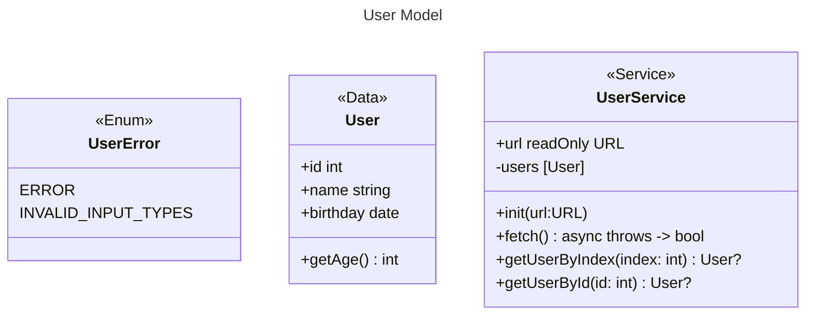

## 設計

```openapi
openapi: 3.0.0
# 基本情報
info:
  title: Userリスト API
  description: この API を使用すると、クライアントはUserのリストを取得できます。
  version: 1.0.0
servers:
  - url: https://api.userlist.com

paths:
  /users:
    get:
      summary: ユーザーリスト取得

      # レスポンスの定義
      responses:
        # code=200
        '200':
          description: ユーザーリスト
          content:
            application/json:
              schema:
                type: array
                items:
                  $ref: './components.yaml#/components/schemas/User'

              # 例
              examples:
                $ref: './examples.yaml#/examples'
```

```openapi
components:
  schemas:
    User:
      type: object
      properties:
        id:
          type: integer
        name:
          type: string
        birthday:
          type: string
          format: date

```

- <<Data>>は freezeObject


