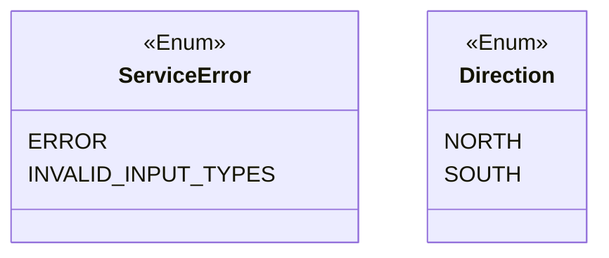
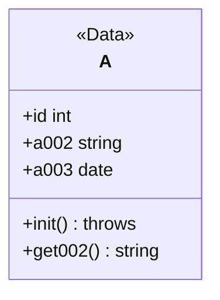
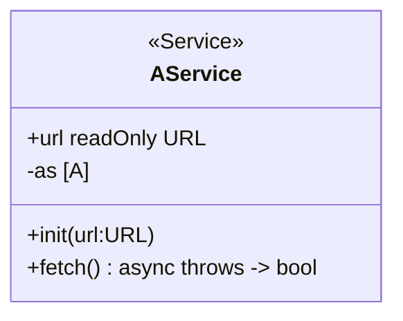

次のタスクを実行してください

## タスク

mermaid の Class 図をもとに Javascript(NodeJS)のコードを作成してください

- <<Enum>> を Enum に変換
- <<Data>> を DataClass に変換
- <<Service>> を ServiceClass に変換
  - URL のハードコード禁止
- mermaid の型を優先してください（ Javascript(NodeJS) の該当型に変換 ）
- async, throws などの修飾子は重視してください
- camelCase

## mermaid から JS への変換例

### Enum



```js
const StoreError = Object.freeze({
  ERROR: "ERROR",
  INVALID_INPUT_TYPES: "INVALID_INPUT_TYPES",
});

const Direction = Object.freeze({
  NORTH: "NORTH",
  SOUTH: "SOUTH",
});
```

## DataClass 例



```js
"use strict";

class A {
  constructor(id, a002, a003) {
    this.id = id;
    this.a002 = a002;
    this.a003 = a003;
  }

  getAge() {
    return this.a002;
  }
}
```

## ServiceClass 例



```js
'use strict';

class AService {
  #as;

  constructor(url) {
    if (typeof url !== "string") {
      throw new Error(StoreError.INVALID_INPUT_TYPES);
    }

    Object.defineProperty(this, "url", { value: url, writable: false });
    this.#as = [];
  }

  async fetch() {
    let jsonData;
    try {
      const response = await fetch(this.url);
      jsonData = await response.json();
    } catch (error) {
      throw new Error(UserError.ERROR);
    }

    if (!Array.isArray(jsonData)) {
      throw new Error(UserError.ERROR);
    }

    this.#as = this.#decode(jsonData)

	  return true
  }

  #decode(jsonData) {
	return jsonData.map((a) =>
      this.#createA(a.id, a.a002, a.a003)
    );
  }

  #createA(id, name, birthday) {
    if (
    ~ implementation ~
      typeof a003 !== "string"
    ) {
      throw new Error(StoreError.INVALID_INPUT_TYPES);
    }

    const a003Date = new Date(a003);
    if (isNaN(a003Date.getTime())) {
      throw new Error(StoreError.INVALID_BIRTHDAY_DATA);
    }
    return Object.freeze(new A(id, a002, a003Date));
  }
}
```

### access modifier

mermaid 上の private な var や function は Javascript では#プライベートフィールドとする
