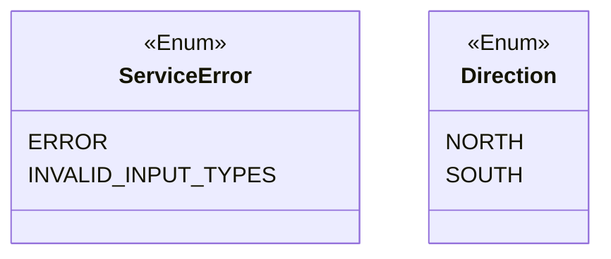
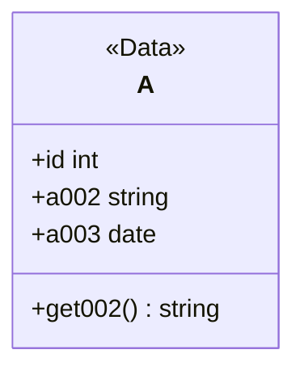
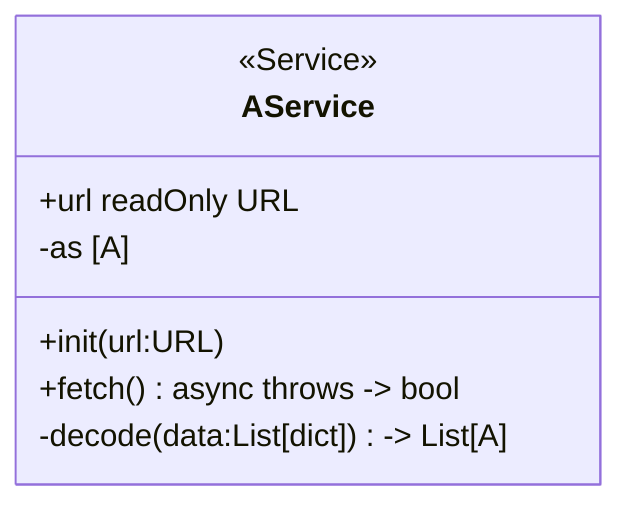

次のタスクを実行してください

## タスク

mermaid の Class 図をもとに Python のコードを作成してください

- <<Enum>> を Enum に変換
- <<Data>> を DataClass に変換
- <<Service>> を ServiceClass に変換
  - URL のハードコード禁止
  - httpx 使用
- mermaid の型を優先してください（ Python の該当型に変換 ）
- async, throws などの修飾子は重視してください
- snake_case

## Enum 例



```python
class ServiceError(Enum):
	ERROR = "ERROR"
	INVALID_INPUT_TYPES = "INVALID_INPUT_TYPES"

class CustomException(Exception):
    def __init__(self, error: ServiceError, message: str = ""):
        self.error = error
        self.message = message
        super().__init__(f"{error.value}: {message}")

class Direction(Enum):
	NORTH: "NORTH",
	SOUTH: "SOUTH",
```

## DataClass 例



```python
@dataclass(frozen=True)
class A:
    id: int
    a002: str
    a003: datetime

    def get002(self) -> str:
        return self.a002
```

## ServiceClass 例



```python

class AService:
    _url: str
    _as_data: List[A] = []

    @property
    def url(self) -> str:
        return self._url

    def __init__(self, url: str):
        ~ implementation ~

    async def fetch(self) -> bool:
        async with httpx.AsyncClient() as client:
            try:
                ~ implementation ~
                self._as_data = self._decode(as_data = as_data)
                return True
            except Exception as e:
                raise CustomException(ServiceError.ERROR, str(e)) from e

    def _decode(self, as_data: List[dict]) -> List[A]:
        _list = []
        for a in as_data:
            try:
                ~ implementation ~
                if not (isinstance(id, int) and isinstance(a002, str) and isinstance(a003, str)):
                    raise CustomException(ServiceError.INVALID_INPUT_TYPES)
                a003 = datetime.strptime(a003, "%Y-%m-%d")
                ~ implementation ~
            except KeyError as e:
                raise CustomException(ServiceError.INVALID_INPUT_TYPES, f"Missing key: {e}") from e
        return _list
```

### access modifier

mermaid 上の private な var や function は Python ではシングルアンダースコアとする
